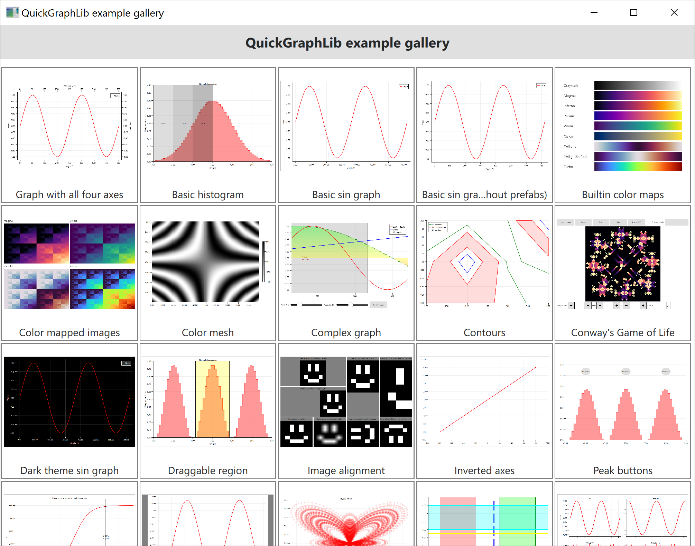

# QuickGraphLib

A scientific graphing library for [QtQuick](https://doc.qt.io/qt-6/qtquick-index.html) using Qt6.

Key advantages:

 - Written in pure QML (with some optional Python helpers), so it can be used in both C++ and Python projects
 - QtQuick's hardware-based rendering makes this library render very fast
 - Support for line graphs, histograms, contour plots and more
 - Interactivity supported natively though declarative bindings and QtQuick
 - Support for PNG and SVG export

## Examples

The example gallery can be run using (provided the Python environment has [PySide6](https://pypi.org/project/PySide6/) and [contourpy](https://pypi.org/project/contourpy/) installed):

```bash
python examples\gallery.py
```

<p align="center"></p>
